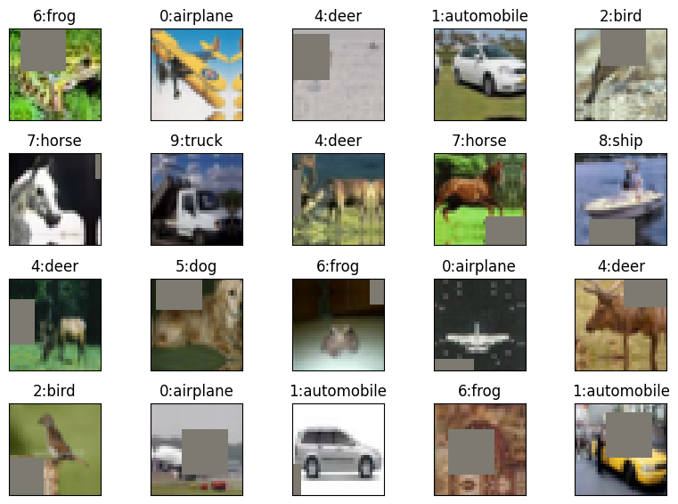
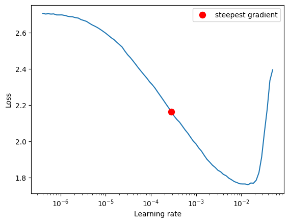
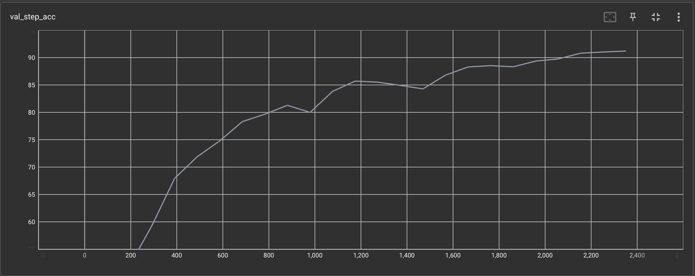
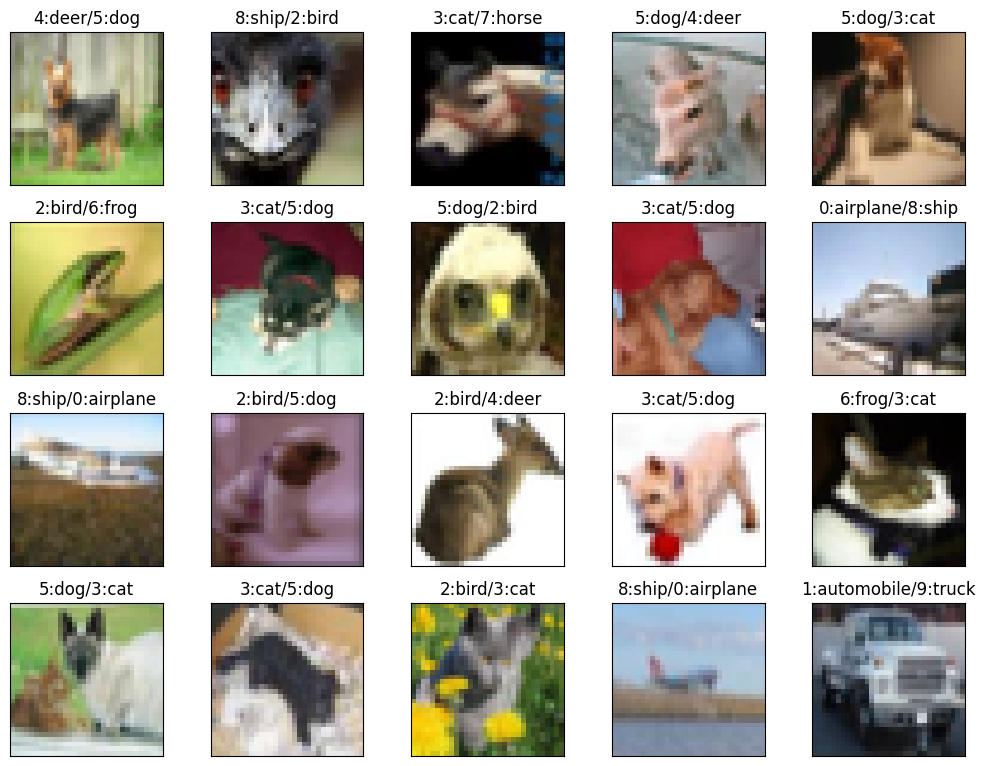
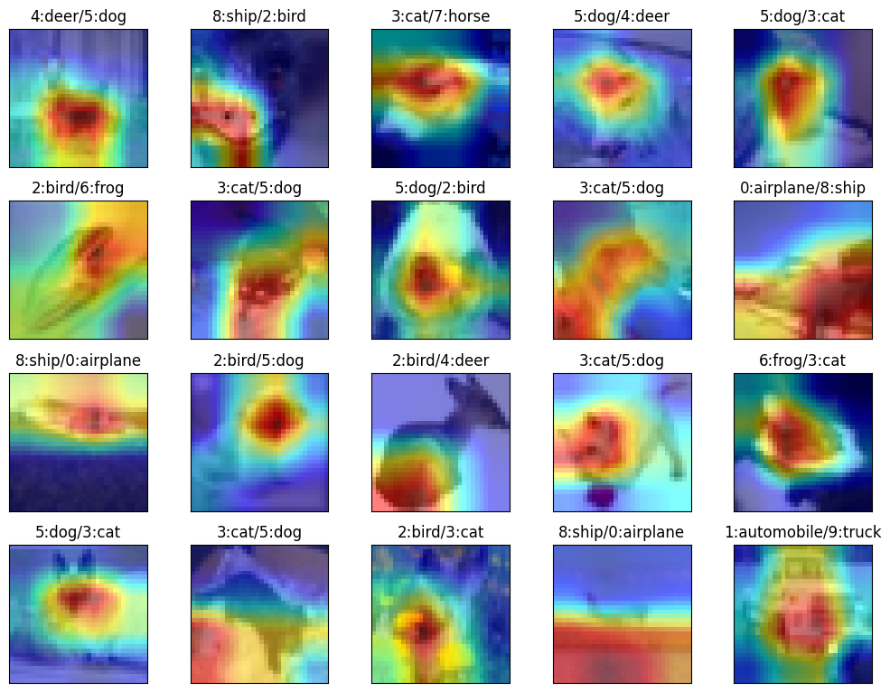

# ERA V1 Session 12

## Code Structure

This model was trained using [Pytorch Lightning](https://lightning.ai).

To view this in action, check this [Hugging Face app](https://huggingface.co/spaces/swapniel99/cifar10)

### datasets Module
#### 1a. datasets/generic.py Module
The datasets module contains a generic MyDataSet class which creates train and test loaders and can visualise examples with labels.
It also performs basic transforms like Normalize and ToTensorV2.

We have two datasets currently in the modeule MNIST and CIFAR10 but can easily be extended with more datasets.


#### 1b. datasets/cifar10.py Module
This module inherits the generic module and applies operations specific to cifar10 which include the Image Augmentations.
Image Augmentations used:
```python
import albumentations as A

default_alb_transforms = [
    A.Normalize(mean, std),
    A.ToGray(p=0.2),
    A.PadIfNeeded(40, 40, p=1),
    A.RandomCrop(32, 32, p=1),
    A.HorizontalFlip(p=0.5),
    # Since normalisation was the first step, mean is already 0, so cutout fill_value = 0
    A.CoarseDropout(max_holes=1, max_height=8, max_width=8, fill_value=0, p=1),
    A.pytorch.ToTensorV2()
]
```



### 2. models Module
This module contains custom modification of resnet Model using Pytorch Lightning.

```
INFO:pytorch_lightning.callbacks.model_summary:
   | Name                               | Type             | Params
-------------------------------------------------------------------------
0  | network                            | Sequential       | 6.6 M 
1  | network.0                          | CustomLayer      | 1.9 K 
2  | network.0.pool_block               | ConvLayer        | 1.9 K 
3  | network.0.pool_block.all_layers    | Sequential       | 1.9 K 
4  | network.0.pool_block.all_layers.0  | Conv2d           | 1.7 K 
5  | network.0.pool_block.all_layers.1  | BatchNorm2d      | 128   
6  | network.0.pool_block.all_layers.2  | ReLU             | 0     
7  | network.0.pool_block.all_layers.3  | Dropout          | 0     
8  | network.1                          | CustomLayer      | 369 K 
9  | network.1.pool_block               | ConvLayer        | 74.0 K
10 | network.1.pool_block.all_layers    | Sequential       | 74.0 K
11 | network.1.pool_block.all_layers.0  | Conv2d           | 73.7 K
12 | network.1.pool_block.all_layers.1  | MaxPool2d        | 0     
13 | network.1.pool_block.all_layers.2  | BatchNorm2d      | 256   
14 | network.1.pool_block.all_layers.3  | ReLU             | 0     
15 | network.1.pool_block.all_layers.4  | Dropout          | 0     
16 | network.1.res_block                | Sequential       | 295 K 
17 | network.1.res_block.0              | ConvLayer        | 147 K 
18 | network.1.res_block.0.all_layers   | Sequential       | 147 K 
19 | network.1.res_block.0.all_layers.0 | Conv2d           | 147 K 
20 | network.1.res_block.0.all_layers.1 | BatchNorm2d      | 256   
21 | network.1.res_block.0.all_layers.2 | ReLU             | 0     
22 | network.1.res_block.0.all_layers.3 | Dropout          | 0     
23 | network.1.res_block.1              | ConvLayer        | 147 K 
24 | network.1.res_block.1.all_layers   | Sequential       | 147 K 
25 | network.1.res_block.1.all_layers.0 | Conv2d           | 147 K 
26 | network.1.res_block.1.all_layers.1 | BatchNorm2d      | 256   
27 | network.1.res_block.1.all_layers.2 | ReLU             | 0     
28 | network.1.res_block.1.all_layers.3 | Dropout          | 0     
29 | network.2                          | CustomLayer      | 295 K 
30 | network.2.pool_block               | ConvLayer        | 295 K 
31 | network.2.pool_block.all_layers    | Sequential       | 295 K 
32 | network.2.pool_block.all_layers.0  | Conv2d           | 294 K 
33 | network.2.pool_block.all_layers.1  | MaxPool2d        | 0     
34 | network.2.pool_block.all_layers.2  | BatchNorm2d      | 512   
35 | network.2.pool_block.all_layers.3  | ReLU             | 0     
36 | network.2.pool_block.all_layers.4  | Dropout          | 0     
37 | network.3                          | CustomLayer      | 5.9 M 
38 | network.3.pool_block               | ConvLayer        | 1.2 M 
39 | network.3.pool_block.all_layers    | Sequential       | 1.2 M 
40 | network.3.pool_block.all_layers.0  | Conv2d           | 1.2 M 
41 | network.3.pool_block.all_layers.1  | MaxPool2d        | 0     
42 | network.3.pool_block.all_layers.2  | BatchNorm2d      | 1.0 K 
43 | network.3.pool_block.all_layers.3  | ReLU             | 0     
44 | network.3.pool_block.all_layers.4  | Dropout          | 0     
45 | network.3.res_block                | Sequential       | 4.7 M 
46 | network.3.res_block.0              | ConvLayer        | 2.4 M 
47 | network.3.res_block.0.all_layers   | Sequential       | 2.4 M 
48 | network.3.res_block.0.all_layers.0 | Conv2d           | 2.4 M 
49 | network.3.res_block.0.all_layers.1 | BatchNorm2d      | 1.0 K 
50 | network.3.res_block.0.all_layers.2 | ReLU             | 0     
51 | network.3.res_block.0.all_layers.3 | Dropout          | 0     
52 | network.3.res_block.1              | ConvLayer        | 2.4 M 
53 | network.3.res_block.1.all_layers   | Sequential       | 2.4 M 
54 | network.3.res_block.1.all_layers.0 | Conv2d           | 2.4 M 
55 | network.3.res_block.1.all_layers.1 | BatchNorm2d      | 1.0 K 
56 | network.3.res_block.1.all_layers.2 | ReLU             | 0     
57 | network.3.res_block.1.all_layers.3 | Dropout          | 0     
58 | network.4                          | MaxPool2d        | 0     
59 | network.5                          | Flatten          | 0     
60 | network.6                          | Linear           | 5.1 K 
61 | criterion                          | CrossEntropyLoss | 0     
62 | train_accuracy                     | RunningAccuracy  | 0     
63 | val_accuracy                       | RunningAccuracy  | 0     
64 | train_loss                         | MeanMetric       | 0     
65 | val_loss                           | MeanMetric       | 0     
-------------------------------------------------------------------------
6.6 M     Trainable params
0         Non-trainable params
6.6 M     Total params
26.293    Total estimated model params size (MB)
```

### 3. utils Module
#### 3a. utils/metrics.py
This module defines any custom metric classes we create.
Currently, it contains RunningAccuracy class which accumulates running accuracy for each epoch.

#### 3b. utils/experiment.py
This module contains the experiment class, which carries out training and testing.
Apart from this it also does the following:
1. Performs train-test iterations for a given number of epochs or a given validation target accuracy.
2. Show Misclassified examples
3. Create GradCAM visualisations of misclassified examples

#### 3c. utils/misc.py Module
This module contains following miscellaneous functions:
1. Set random seed
2. Check for GPU device
3. Plot dataset images
4. Get Model summary
5. Create GradCAM visualizations
6. Calculate incorrect predictions

## The Results

Best Train Accuracy: 92.76%

Best Test Accuracy: 91.2%

We use ADAM Optimizer with One Cycle LR. Here we used LR Finder to get the steepest LR.



Validation Loss:


Validation Accuracy:


Misclassified Images:



GradCAM for misclassified images:


