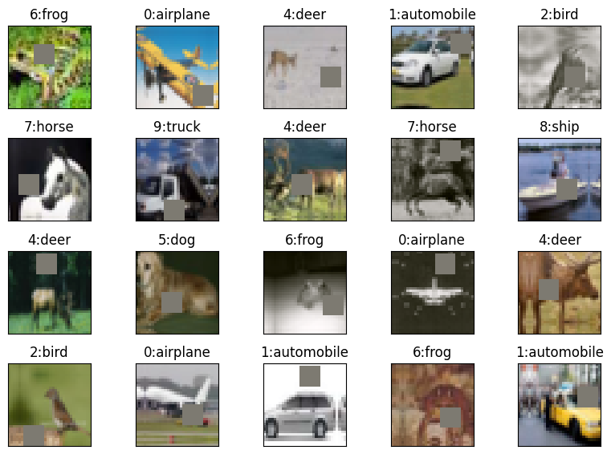

# epoch

This is a common modular library created in pytorch for ERAv1.

## Code Structure

### datasets Module
#### 1a. datasets/generic.py Module
The datasets module contains a generic MyDataSet class which creates train and test loaders and can visualise examples with labels.
It also performs basic transforms like Normalize and ToTensorV2.

We have two datasets currently in the modeule MNIST and CIFAR10 but can easily be extended with more datasets.


#### 1b. datasets/cifar10.py Module
This module inherits the generic module and applies operations specific to cifar10 which include the Image Augmentations.
Image Augmentations used:
```python
import albumentations as A

default_alb_transforms = [
    A.HorizontalFlip(p=0.5),
    A.PadIfNeeded(40, 40, p=1),
    A.RandomCrop(32, 32, p=1),
    # Padding value doesnt matter here.
    A.PadIfNeeded(64, 64, border_mode=cv2.BORDER_CONSTANT, value=0, p=1),
    # Since normalisation was the first step, mean is already 0, so cutout fill_value = 0
    A.CoarseDropout(max_holes=1, max_height=16, max_width=16, fill_value=0, p=1),
    A.CenterCrop(32, 32, p=1)
]
```



### 2. models Module
This module contains all the model definitions.

### 3. utils Module
#### 3a. utils/backprop.py
This module contains the Train and Test classes which are used in an experiment.
Train and Test classes perform training and testing respectively on given model and dataset.
They also accumulate statistics which can be plotted using a simple member functions.

#### 3b. utils/experiment.py
This module contains the experiment class, which carries out training and testing.
Apart from this it also does the following:
1. Performs train-test iterations for a given number of epochs or a given validation target accuracy.
2. Configure Optimizer and Scheduler
3. Show Misclassified examples
4. Create GradCAM visualisations of misclassified examples

#### 3c. utils/misc.py Module
This module contains following miscellaneous functions:
1. Set random seed
2. Check for GPU device
3. Plot dataset images
4. Get Model summary
